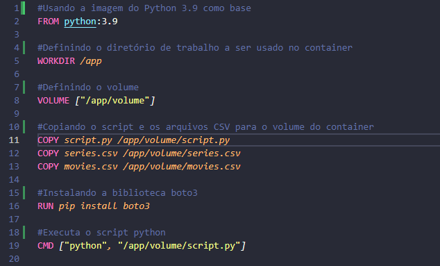

# Data Lake na AWS — Estudo de Caso: Filmes de Ação e Aventura (1970–2020)

**Autores:** Diego Luis Oliveira · Gilberto Cury Netto · Rafael Nascimento Prado

---

## Visão Geral

Este repositório documenta, em detalhe, a metodologia seguida na construção de um pipeline de dados completo na AWS — da ingestão bruta à visualização analítica — tendo como objeto de estudo filmes dos gêneros ação e aventura lançados entre 1970 e 2020. O projeto percorre todas as camadas de uma arquitetura *data lake* moderna: **Raw → Trusted → Pre-Refined → Refined**, utilizando serviços como S3, Lambda, Glue, Athena e QuickSight.

A base de dados combina dois conjuntos distintos: um arquivo CSV proveniente de fonte local (com informações de títulos e artistas) e um conjunto de JSONs coletados via API do The Movie Database (TMDb), enriquecidos com detalhes de bilheteria, orçamento, popularidade e avaliação.

---

## Sumário

1. [Configuração do Ambiente e Ingestão (Camada Raw)](#1-configuração-do-ambiente-e-ingestão-camada-raw)
2. [Coleta via API TMDb com AWS Lambda](#2-coleta-via-api-tmdb-com-aws-lambda)
3. [Processamento e Limpeza com AWS Glue (Camada Trusted)](#3-processamento-e-limpeza-com-aws-glue-camada-trusted)
4. [Cruzamento de Dados e Modelagem Dimensional (Camada Refined)](#4-cruzamento-de-dados-e-modelagem-dimensional-camada-refined)
5. [Visualização com AWS QuickSight](#5-visualização-com-aws-quicksight)
6. [Resultados e Análises](#6-resultados-e-análises)

---

## 1. Configuração do Ambiente e Ingestão (Camada Raw)

### 1.1 Containerização com Docker

O primeiro passo do pipeline foi criar um ambiente reproduzível para o upload dos arquivos CSV ao S3. Para isso, foi utilizado um contêiner Docker baseado em Python 3.9, responsável por instalar a biblioteca `boto3` e executar o script de upload de forma automatizada.

```dockerfile
FROM python:3.9

WORKDIR /app

VOLUME ["/app/volume"]

COPY script.py /app/volume/script.py
COPY series.csv /app/volume/series.csv
COPY movies.csv /app/volume/movies.csv

RUN pip install boto3

CMD ["python", "/app/volume/script.py"]
```

A imagem utiliza `python:3.9` como base, configura `/app` como diretório de trabalho, cria um volume persistente, copia os arquivos de dados e o script para dentro do contêiner, instala a dependência `boto3` e, ao iniciar, executa o script de upload automaticamente.

**Evidência — criação da imagem:**



### 1.2 Script de Upload para o S3

O script Python a seguir conecta-se ao S3 e realiza o envio dos arquivos `movies.csv` e `series.csv` para o bucket `data-lake-do-rafael-prado`, organizando os dados com uma estrutura de pastas hierárquica que inclui camada, origem, formato, tipo de dado e data de processamento.

```python
import boto3
from datetime import datetime

arquivo_filmes = '/app/movies.csv'
arquivo_series = '/app/series.csv'
bucket = 'data-lake-do-rafael-prado'
camada = 'Raw'
origem = 'Local'
formato = 'CSV'
especificacao_filmes = 'Movies'
especificacao_series = 'Series'
data_processamento = datetime.now().strftime('%Y/%m/%d')

s3 = boto3.client('s3')

def enviar_para_s3(arquivo_local, especificacao, arquivo_nome):
    caminho_s3 = f"{camada}/{origem}/{formato}/{especificacao}/{data_processamento}/{arquivo_nome}"
    s3.upload_file(arquivo_local, bucket, caminho_s3)
    print(f"Arquivo '{arquivo_nome}' enviado para o S3 em: {caminho_s3}")

enviar_para_s3(arquivo_filmes, especificacao_filmes, 'movies.csv')
enviar_para_s3(arquivo_series, especificacao_series, 'series.csv')
```

A função `enviar_para_s3` constrói o caminho de destino dinamicamente, garantindo que cada execução registre a data de processamento no próprio path do arquivo — prática essencial para rastreabilidade em pipelines de dados.

**Evidências:**


---

## 2. Coleta via API TMDb com AWS Lambda

### 2.1 Preparação do Ambiente Lambda

Para a coleta dos dados complementares via API, foi necessário criar um ambiente de execução compatível com o AWS Lambda. Utilizou-se um contêiner baseado em Amazon Linux 2023 para construir a *Lambda Layer* contendo as bibliotecas `requests` e `boto3`.

```dockerfile
FROM amazonlinux:2023
RUN yum update -y
RUN yum install -y \
    python3-pip \
    zip
RUN yum -y clean all
```

A layer foi empacotada em ZIP, enviada ao S3 e, em seguida, vinculada à função Lambda. Esse processo garante que as dependências externas ao runtime padrão do Lambda fiquem disponíveis durante a execução.

**Evidências:**


### 2.2 Função Lambda — Coleta de Dados do TMDb

A função Lambda a seguir consulta a API do TMDb para obter filmes dos gêneros ação e aventura lançados entre 1970 e 2020, com nota média igual ou superior a 8. Os dados são coletados com paginação, enriquecidos com detalhes individuais por filme e salvos em arquivos JSON no S3, em lotes de 100 registros.

```python
import requests
import json
import boto3
from datetime import datetime

api_key = "6a0efdab02802a37b023045239e9c652"
base_discover_url = "https://api.themoviedb.org/3/discover/movie"
base_detail_url = "https://api.themoviedb.org/3/movie"
language = "pt-BR"
s3_bucket = "data-lake-do-rafael-prado"
s3_folder = "Raw/TMDB/JSON"
s3 = boto3.client("s3")

def buscar_filmes_basicos(api_key, pagina):
    url = f"{base_discover_url}?api_key={api_key}&language={language}&page={pagina}&primary_release_date.gte=1970-01-01&primary_release_date.lte=2020-12-31&vote_average.gte=8&with_genres=28,12"
    resposta = requests.get(url)
    if resposta.status_code == 200:
        return resposta.json().get("results", [])
    return []

def buscar_detalhes_filme(api_key, movie_id):
    url = f"{base_detail_url}/{movie_id}?api_key={api_key}&language={language}"
    resposta = requests.get(url)
    if resposta.status_code == 200:
        return resposta.json()
    return None

def lambda_handler(event, context):
    total_filmes = 3000
    filmes_por_arquivo = 100
    pagina_atual = 1
    filmes_coletados = []

    data_atual = datetime.now()
    ano = data_atual.strftime("%Y")
    mes = data_atual.strftime("%m")
    dia = data_atual.strftime("%d")

    while len(filmes_coletados) < total_filmes and pagina_atual <= 150:
        filmes_basicos = buscar_filmes_basicos(api_key, pagina_atual)
        if not filmes_basicos:
            break
        for filme in filmes_basicos:
            detalhes = buscar_detalhes_filme(api_key, filme["id"])
            if detalhes:
                filmes_coletados.append(detalhes)
        pagina_atual += 1

    filmes_coletados = filmes_coletados[:total_filmes]

    for i in range(0, len(filmes_coletados), filmes_por_arquivo):
        parte = i // filmes_por_arquivo + 1
        nome_arquivo = f"filmes-acao-aventura-1970-2020-part-{parte}.json"
        caminho_s3 = f"{s3_folder}/{ano}/{mes}/{dia}/{nome_arquivo}"
        json_data = json.dumps(filmes_coletados[i:i + filmes_por_arquivo], ensure_ascii=False, indent=4)
        s3.put_object(
            Bucket=s3_bucket,
            Key=caminho_s3,
            Body=json_data,
            ContentType="application/json"
        )

    return {
        "statusCode": 200,
        "body": f"{len(filmes_coletados)} filmes salvos no bucket S3 '{s3_bucket}' na pasta '{s3_folder}/{ano}/{mes}/{dia}'."
    }
```

**Evidências:**


---

## 3. Processamento e Limpeza com AWS Glue (Camada Trusted)

Com os dados brutos armazenados no S3, a etapa seguinte consistiu na aplicação de um processo de ETL (Extração, Transformação e Carga) utilizando AWS Glue com PySpark. Foram criados dois jobs distintos — um para os arquivos CSV e outro para os JSONs — que limpam, transformam e salvam os dados no formato Parquet na camada Trusted.

### 3.1 Job ETL — CSV para Parquet

```python
import sys
from pyspark.context import SparkContext
from awsglue.context import GlueContext
from awsglue.dynamicframe import DynamicFrame
from awsglue.job import Job
from awsglue.utils import getResolvedOptions
from datetime import datetime

source_file = "s3://data-lake-do-rafael-prado/Raw/Local/CSV/Movies/2024/11/11/movies.csv"

sc = SparkContext()
glueContext = GlueContext(sc)
spark = glueContext.spark_session
job = Job(glueContext)
job.init("MoviesJob", {})

df = spark.read.option("delimiter", "|").csv(source_file, header=True, inferSchema=True)

df_tratado = df.drop("titulosMaisConhecidos", "profissao", "anoFalecimento",
                     "anoNascimento", "nomeArtista", "personagem")
df_tratado = df_tratado.dropna().dropDuplicates()

if df_tratado.count() == 0:
    raise ValueError("Nenhum dado disponível para salvar no destino.")

dynamic_frame_tratado = DynamicFrame.fromDF(df_tratado, glueContext)

data_atual = datetime.now()
target_path = f"s3://data-lake-do-rafael-prado/Trusted/CSV/{data_atual.strftime('%Y/%m/%d')}/"

glueContext.write_dynamic_frame.from_options(
    frame=dynamic_frame_tratado,
    connection_type="s3",
    connection_options={"path": target_path},
    format="parquet"
)

job.commit()
```

As transformações aplicadas foram: remoção de colunas irrelevantes para a análise (informações de artistas não utilizadas na modelagem final), eliminação de linhas com valores nulos e remoção de registros duplicados.

### 3.2 Job ETL — JSON para Parquet

```python
import sys
from datetime import datetime
from awsglue.transforms import *
from awsglue.utils import getResolvedOptions
from pyspark.context import SparkContext
from awsglue.context import GlueContext
from awsglue.job import Job
from awsglue.dynamicframe import DynamicFrame
from pyspark.sql.functions import col, udf, to_date, when
from pyspark.sql.types import ArrayType, StringType

args = getResolvedOptions(sys.argv, ['JOB_NAME'])
sc = SparkContext()
glueContext = GlueContext(sc)
spark = glueContext.spark_session
job = Job(glueContext)
job.init(args['JOB_NAME'], args)

source_path = "s3://data-lake-do-rafael-prado/Raw/TMDB/JSON/2024/11/28/"

dynamic_frame_tratado = glueContext.create_dynamic_frame.from_options(
    connection_type="s3",
    connection_options={"paths": [source_path]},
    format="json"
)

data_frame = dynamic_frame_tratado.toDF()

def extrair_nomes_dos_generos(genres):
    return [genre['name'] for genre in genres]

extrair_nomes_dos_generos_udf = udf(extrair_nomes_dos_generos, ArrayType(StringType()))
data_frame = data_frame.withColumn("genres", extrair_nomes_dos_generos_udf(col("genres")))
data_frame = data_frame.withColumn("release_date", to_date(data_frame["release_date"], "yyyy-MM-dd"))

colunas_manter = ["id", "title", "original_title", "release_date", "runtime",
                  "vote_count", "vote_average", "revenue", "original_language"]
filtered_data_frame = data_frame.select(*colunas_manter)

data_frame_tratado = filtered_data_frame.dropna(subset=["title", "original_title"])
data_frame_tratado = data_frame_tratado.filter(
    data_frame_tratado.title.isNotNull() & data_frame_tratado.original_title.isNotNull()
)
data_frame_tratado = data_frame_tratado.dropDuplicates(colunas_manter)
data_frame_tratado = data_frame_tratado.withColumn("revenue", col("revenue.int").cast("int"))
data_frame_tratado = data_frame_tratado.withColumn("revenue", when(col("revenue") == 0, None).otherwise(col("revenue")))
data_frame_tratado = data_frame_tratado.withColumn("runtime", col("runtime").cast("int"))
data_frame_tratado = data_frame_tratado.withColumn("vote_count", col("vote_count").cast("int"))
data_frame_tratado = data_frame_tratado.withColumn("vote_average", col("vote_average").cast("float"))

dynamic_frame_tratado_transformado = DynamicFrame.fromDF(data_frame_tratado, glueContext, "dynamic_frame_tratado_transformado")

data_atual = datetime.now()
target_path = f"s3://data-lake-do-rafael-prado/Trusted/JSON/{data_atual.strftime('%Y/%m/%d')}/"

glueContext.write_dynamic_frame.from_options(
    frame=dynamic_frame_tratado_transformado,
    connection_type="s3",
    connection_options={"path": target_path},
    format="parquet"
)

job.commit()
```

As transformações no JSON incluíram: extração dos nomes dos gêneros a partir de objetos aninhados via UDF, conversão da coluna `release_date` para tipo `date`, seleção das colunas relevantes, remoção de nulos e duplicatas, correção de tipos (inteiro para `revenue`, `runtime`, `vote_count` e float para `vote_average`) e substituição de valores `0` na receita por `null`.

### 3.3 Catalogação com AWS Glue Crawlers e Consulta no Athena

Após a geração dos arquivos Parquet, foram criados crawlers no AWS Glue para catalogar automaticamente as tabelas no AWS Glue Data Catalog. As tabelas resultantes foram consultadas no AWS Athena para validação do schema e dos dados transformados.

**Evidências:**


---

## 4. Cruzamento de Dados e Modelagem Dimensional (Camada Refined)

### 4.1 Job ETL — Camada Pré-Refined

Este job realiza o cruzamento dos dados provenientes das camadas Trusted (CSV e JSON), unindo os registros comuns pelo título do filme. O campo `generoArtista` do CSV é incorporado ao dataset JSON como metadado adicional. Como um mesmo filme pode ter registros de atores e atrizes separadamente, o campo foi agrupado em lista e, em seguida, convertido para string para facilitar a visualização posterior.

```python
import sys
from datetime import datetime
from awsglue.transforms import *
from awsglue.utils import getResolvedOptions
from pyspark.context import SparkContext
from awsglue.context import GlueContext
from awsglue.job import Job
from pyspark.sql import functions as F
from awsglue.dynamicframe import DynamicFrame

args = getResolvedOptions(sys.argv, ['JOB_NAME'])
sc = SparkContext()
glueContext = GlueContext(sc)
spark = glueContext.spark_session
job = Job(glueContext)
job.init(args['JOB_NAME'], args)

caminho_s3_entrada1 = "s3://data-lake-do-rafael-prado/Trusted/JSON/2024/12/13/"
caminho_s3_entrada2 = "s3://data-lake-do-rafael-prado/Trusted/CSV/2024/12/12/"

dados_json = glueContext.create_dynamic_frame.from_options(
    connection_type="s3",
    connection_options={"paths": [caminho_s3_entrada1]},
    format="parquet"
).toDF()

dados_csv = glueContext.create_dynamic_frame.from_options(
    connection_type="s3",
    connection_options={"paths": [caminho_s3_entrada2]},
    format="parquet"
).toDF()

dados_csv = dados_csv.withColumnRenamed("generoArtista", "artist_genre")

dados_juntos = dados_json.join(dados_csv, dados_json["title"] == dados_csv["tituloPincipal"], "inner") \
                         .select(dados_json["*"], dados_csv["artist_genre"])

dados_agrupados = dados_juntos.groupBy(
    "id", "title", "original_title", "release_date", "runtime",
    "vote_count", "vote_average", "revenue", "original_language",
    "genres", "origin_country", "adult", "budget", "popularity"
).agg(F.collect_set("artist_genre").alias("artist_genre"))

dados_agrupados = dados_agrupados.withColumn("artist_genre", F.concat_ws(", ", F.col("artist_genre")))

dynamic_frame_agrupado = DynamicFrame.fromDF(dados_agrupados, glueContext, "dynamic_frame_agrupado")

data_atual = datetime.now()
caminho_s3_saida = f"s3://data-lake-do-rafael-prado/pre-refined/{data_atual.strftime('%Y/%m/%d')}/"

glueContext.write_dynamic_frame.from_options(
    frame=dynamic_frame_agrupado,
    connection_type="s3",
    connection_options={"path": caminho_s3_saida},
    format="parquet"
)

job.commit()
```

### 4.2 Job ETL — Modelagem Dimensional (Camada Refined)

A partir dos dados da camada Pré-Refined, este job implementa um modelo dimensional estrela com três tabelas dimensão e uma tabela fato. Os IDs das dimensões Tempo e Localização são gerados com `row_number()` sobre uma `Window`, já que essas entidades não possuem identificadores naturais nos dados de origem. Os IDs da dimensão Filme são preservados do dado original (ID do TMDb).

```python
import sys
from awsglue.transforms import *
from awsglue.utils import getResolvedOptions
from pyspark.context import SparkContext
from awsglue.context import GlueContext
from awsglue.job import Job
from awsglue.dynamicframe import DynamicFrame
from pyspark.sql.functions import explode, split, trim, col, row_number, year, month, dayofmonth, regexp_replace
from pyspark.sql.window import Window

args = getResolvedOptions(sys.argv, ['JOB_NAME'])
sc = SparkContext()
glueContext = GlueContext(sc)
spark = glueContext.spark_session
job = Job(glueContext)
job.init(args['JOB_NAME'], args)

input_path = "s3://data-lake-do-rafael-prado/pre-refined/2024/12/13/"
output_path = "s3://data-lake-do-rafael-prado/Refined/"

datasource0 = glueContext.create_dynamic_frame.from_options(
    format_options={"multiline": False},
    connection_type="s3",
    format="parquet",
    connection_options={"paths": [input_path], "recurse": True},
    transformation_ctx="datasource0"
)

df = datasource0.toDF()

# Dimensão Filme (usa o ID nativo do TMDb)
dim_filme = df.select("id", "title", "original_title", "runtime", "original_language", "adult", "revenue", "budget")

# Dimensão Tempo
dim_tempo = df.select("release_date").distinct()
dim_tempo = dim_tempo.withColumn("ano", year(col("release_date"))) \
    .withColumn("mes", month(col("release_date"))) \
    .withColumn("dia", dayofmonth(col("release_date")))
windowSpecTempo = Window.orderBy("release_date")
dim_tempo = dim_tempo.withColumn("id_tempo", row_number().over(windowSpecTempo))

# Dimensão Localização
df = df.withColumn("origin_country", trim(regexp_replace(col("origin_country"), "\\[|\\]", "")))
dim_localizacao = df.select(explode(split(col("origin_country"), ",")).alias("localizacao")).distinct()
dim_localizacao = dim_localizacao.withColumn("localizacao", trim(col("localizacao")))
windowSpecLocalizacao = Window.orderBy("localizacao")
dim_localizacao = dim_localizacao.withColumn("id_localizacao", row_number().over(windowSpecLocalizacao))
dim_localizacao = dim_localizacao.dropDuplicates(["localizacao"])
dim_localizacao = dim_localizacao.filter(col("localizacao") != "")

# Fato Filme
df = df.withColumn("localizacao", explode(split(trim(regexp_replace(col("origin_country"), "\\[|\\]", "")), ",")))
fato_filme = df.select("id", "release_date", "vote_count", "vote_average", "popularity", "localizacao")
fato_filme = fato_filme \
    .join(dim_filme.select("id", col("id").alias("id_filme")), on="id") \
    .join(dim_tempo.select("release_date", "id_tempo"), on="release_date", how="left") \
    .join(dim_localizacao.select("localizacao", "id_localizacao"), on="localizacao", how="left")

# Persistência
for dyf, path in [
    (dim_filme,       "dim_filme/"),
    (dim_tempo,       "dim_tempo/"),
    (dim_localizacao, "dim_localizacao/"),
    (fato_filme,      "fato_filme/"),
]:
    glueContext.write_dynamic_frame.from_options(
        DynamicFrame.fromDF(dyf, glueContext, path),
        connection_type="s3",
        connection_options={"path": f"{output_path}{path}"},
        format="parquet"
    )

job.commit()
```

**Evidências:**


---

## 5. Visualização com AWS QuickSight

Com as tabelas dimensionais e de fatos catalogadas no Glue Data Catalog e acessíveis via Athena, a etapa final consistiu na criação dos dashboards analíticos no AWS QuickSight. O processo envolveu a criação dos datasets a partir do Athena, a realização dos joins entre as tabelas (tendo `fato_filme` como tabela principal com left joins para todas as dimensões) e, por fim, a construção da análise com os gráficos.

**Evidências:**


---

## 6. Resultados e Análises

### Era dos Heróis: A Jornada dos Filmes de Ação e Aventura (1970–2020)

Nas décadas de 1970 a 2020, a indústria cinematográfica vivenciou uma transformação profunda nos gêneros de ação e aventura. A análise dos dados coletados revelou padrões significativos sobre produção, investimento, lucratividade e popularidade desse segmento ao longo de cinco décadas.

---

### Gráfico 1 — Número de filmes lançados pelos EUA vs. outros países


Os dados evidenciam que os EUA dominam de forma expressiva a produção de filmes de ação e aventura: o país, sozinho, produziu mais títulos do que todos os demais países analisados somados — o que reflete tanto sua capacidade de investimento quanto a hegemonia do inglês como idioma de alcance global.

---

### Gráfico 2 — Evolução dos lançamentos de ação e aventura nos EUA (1970–2020)


O gráfico revela uma tendência geral de crescimento no número de lançamentos ao longo das décadas. Os anos 70 apresentam volume reduzido, com crescimento mais consistente a partir dos anos 80. Destaques incluem um pico de 15 filmes em 1990 e o maior valor registrado em 2016, com 35 produções. Quedas pontuais, como a observada em 2010–2011, foram seguidas de rápidas recuperações. Os anos 90 se caracterizaram por relativa estabilidade, com variação entre 7 e 13 filmes por ano.

---

### Gráfico 3 — Lucro vs. orçamento dos filmes dos EUA por década


A análise por décadas evidencia uma explosão de rentabilidade a partir dos anos 90. Nessa década, o lucro atingiu 1,94 bilhão de dólares com um orçamento de 0,87 bilhão. Na década de 2010, apesar de um orçamento menor do que o da década anterior, o lucro superou todos os períodos precedentes — comprovando a maturação e eficiência crescente da indústria. A queda aparente nos dados de 2020 reflete o fato de que a base de dados contempla apenas o início daquele ano.

---

### Gráfico 4 — Popularidade vs. orçamento por década


A hipótese de que o orçamento seria diretamente proporcional à popularidade foi confirmada pela análise da média de ambas as variáveis agrupadas por década. Períodos com menor investimento, como a década de 2010, apresentaram queda correspondente na popularidade média, enquanto décadas com maior aporte financeiro registraram os maiores índices de popularidade.

---

### Gráficos 5 e 6 — Duração dos filmes vs. popularidade ao longo das décadas


A análise comparativa entre duração média dos filmes e popularidade por década revela que não há correlação direta entre essas variáveis. Nos anos 80 e 90, a duração média variou pouco, mas a popularidade cresceu. Entre 1990 e 2000, a duração caiu enquanto a popularidade subiu. Na transição de 2000 para 2010, a duração diminuiu e a popularidade despencou — período que coincide com queda nos orçamentos. Entre 2010 e 2020, tanto a duração quanto a popularidade cresceram, mas o aumento paralelo no investimento sugere que o orçamento exerce influência muito mais determinante na popularidade do que a duração do filme.

---

### Gráficos 7 e 8 — Top 10 filmes mais populares: nota, popularidade, orçamento e lucro


A comparação entre os 10 filmes mais populares produzidos pelos EUA revela que a avaliação (nota média) não é determinante da popularidade: "Kung Fu Panda", com nota inferior à de "Deadpool", apresenta popularidade superior. Ao cruzar com os dados de orçamento, observa-se que o maior investimento em "Kung Fu Panda" corrobora a hipótese de que o aporte financeiro é o principal fator de popularidade. "Avatar" lidera em popularidade e bilheteria (2,92 bilhões de dólares), enquanto "Aquaman", em oitava posição em popularidade, foi o segundo filme mais lucrativo do conjunto analisado.

---


